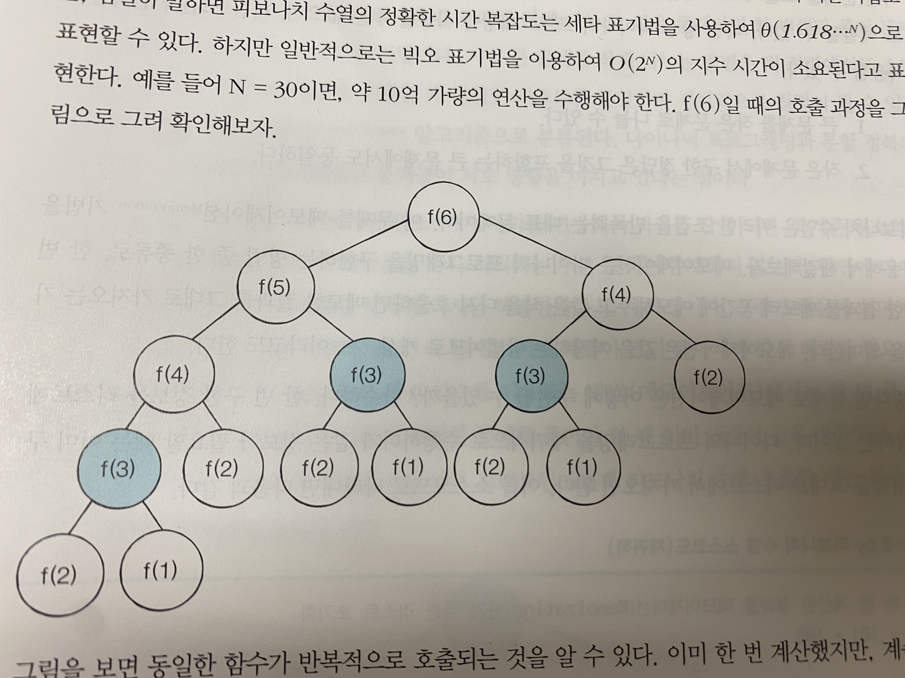

# 다이나믹 프로그램
* 메모리를 적절히 사용하여 수행 시간 효율성을 비약적으로 향상 시키는 녀석
* 이미 계산한거 다시 안해
* 탑다운과 보텀업, 두가지 방식으로 구성됨 
* 동적 계획법이라고 불림
  * 동적이란? **프로그램이 실행되는 도중에 실행에 필요한 메모리를 할당하는 기법**
* 그래서 언제 사용함?
  * **최적 부분 구조**
    * 큰 문제를 작은 문제로 나눌 수 있으며 작은 문제의 답을 모아서 큰 문제를 해결할 수 있음
  * **중복되는 부분 문제**
    * 동일한 작은 문제를 반복적으로 해결해야 함

### 피보나치를 통한 예시
* 일반
<pre><code>def fibo(x):
    if x == 1 or x == 2:
        return 1
    return fibo(x - 1) + fibo(x-2)
</code></pre>
* 동적 가능?

### 최장 증가 부분 수열 (LIS)
* 