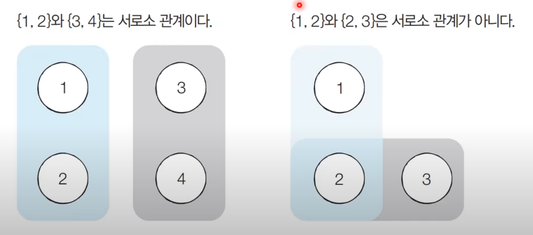

# 기타 그래프 이론

### 서로소 집합 

* 서로소 집합 자료구조는 합치기(Union) 자료구조라고도 함
* 서로소 부분 집합들로 나누어진 원소들의 데이터를 처리하기 위한 자료구조
* 연산
  * 합집합 : 두 개의 원소가 포함된 집합을 하나의 집합으로 합치는 연산
  * 찾기 : 특정한 원소가 속한 집합이 어떤 집합인지 알려주는 연산
* 유튜브 9분 30초