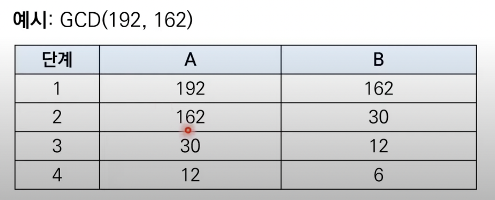
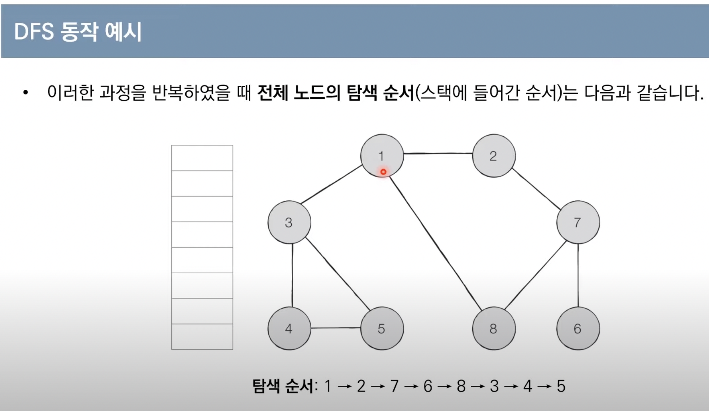

# 그래프 탐색 알고리즘 : DFS / BFS
* 탐색이란 많은 양의 데이터 중에서 원하는 데이터를 찾는 과정


### 스택 자료구조
* 먼저 들어온 데이터가 나중에 나가는 구조
<pre><code>stack = []
stack.append(5)
stack.append(10)
stack.pop()       #10
</code></pre>
* 최상단 원소부터 출력
```stack[::-1]    # 10 5```
* 최하단 원소부터 출력
```stack          # 5 10 ```


### 큐 자료구조
* 선입선출, 대기열 같은 녀석
* 리스트로도 구현은 가능하지만, 속도 측면에서 deque가 훨씬 유리
<pre><code>from collections import deque

queue = deque()

queue.append(5)
queue.append(10)
queue.popleft()       #5
</code></pre>
* 먼저 들어온 순서대로 출력
```queue    # 5 10```
* 나중에 들어온 원소부터 출력
```queue.reverse()     # 10 5 ```


### 재귀 함수
* 반드시 **종료 조건**을 포함할 것
<pre><code>
def rec_func(i):
    if i == 100:
        return
    print(f'{i} 번째 함수에서 {i + 1}재귀 함수를 호출합니다')
    rec_func(i+1)
    print(f'{i} 번째 함수가 종료되었습니다.')

rec_func(1)
</code></pre>

### 유클리드 호제법
* **두 자연수에 대한 최대공약수를 구하는 알고리즘**
* 자연수 A,B (A > B)에 대하여 A를 B로 나눈 나머지를 R이라고 하면,<br /> A와 B의 최대공약수는 B와 R의 최대공약수와 같음
{: width="50%"}

### DFS
* 깊이 우선 탐색
* 깊은 부분을 우선적으로 탐색하는 알고리즘
* **스택** 이나 **재귀함수**를 이용하여 구현
  * 탐색 시작 노드를 스택에 삽입하고 방문 처리
  * 스택의 최상단 노드에 방문하지 않은 인접한 노드가 하나라도 있으면 그 노드를 스택에 넣고 방문 처리, 방문하지 않은 노드가 없으면 스택에서 최상단 노드 꺼내
  * 2번의 과정을 수행할 수 없을 때까지 반복
{: width="50%"}


### BFS 
* **너비 우선 탐색**이라고 부르며, 그래프에서 가까운 노드부터 우선적으로 탐색하는 알고리즘.
* BFS는 **큐** 를 사용
  * 탐색 시작 노드를 큐에 삽입하고 방문 처리를 함
  * 큐에서 노드를 꺼낸 뒤에 해단 노드의 인접 노드 중에서 방문하지 않은 노드를 모두 큐에 삽입하고 방문 처리
  * 2번 과정 수행X 때 까지 반복
  

<pre><code>
</code></pre>
