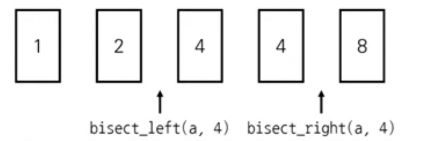

# 이진탐색
* 순차탐색: 리스트 안에 있는 특정한 데이터를 찾기 위해 앞에서부터 데이터를 하나씩 확인하는 방법
* 이진탐색: 정렬되어 있는 리스트에서 탐색 범위를 절반씩 좁혀가며 데이터를 탐색하는 방법
  * 이진탐색은 시작점 끝점 중간점을 이용하여 탐색 범위를 설정함

### 파이썬 이진 탐색 라이브러리
* bisect_left(a,x): 정렬된 순서를 유지하면서 배열 a에 x를 삽입할 가장 왼쪽 인덱스를 반환
* bisect_right(a,x): 정렬된 순서를 유지하면서 배열 a에 x를 삽입할 가장 오른쪽 인덱스를 반환

<pre><code>from bisect import bisect_right, bisect_left

a = [1, 2, 4, 4, 8]
x = 4

print(bisect_left(a, x))   #2
print(bisect_right(a, x))  #4

</code></pre>

## 파라메트릭 서치 (떡볶이 떡 길이 결정 문제 있잖슴)
* 최적화 문제를 결정 문제(에스 오알 낫)으로 바꾸어 해결하는 방법
  * 특정한 조건을 만족하는 가장 알맞은 값을 빠르게 찾는 최적화 문제
* 일반적으로 코딩 테스트에서의 파라케트릭 서치 문제는 이진 탐색을 이용하여 해결할 수 있음