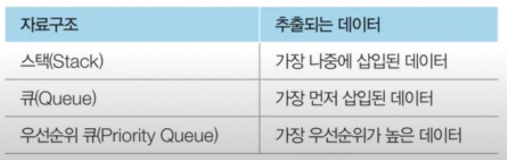
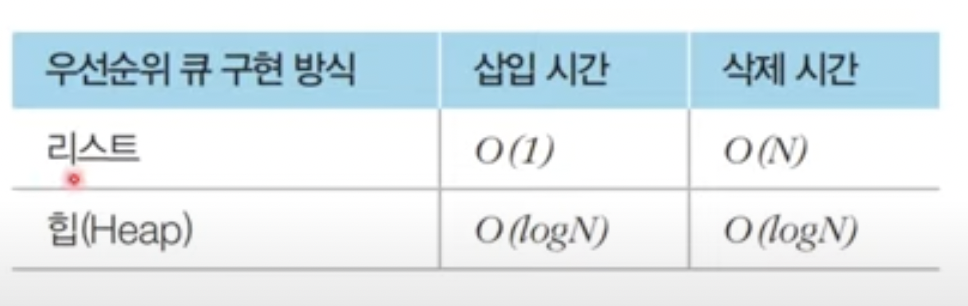

# 최단경로 
* 가장 짧은 경로를 찾는 알고리즘
  * 한 지점에서 다른 한 지점까지의 최단 경로
  * 한 지점에서 다른 모든 지점까지의 최단 경로
  * 모든 지점에서 다른 모든 지점까지의 최단 경로

### 다익스트라
* 특정한 노드에서 출발하여 다른 모든 노드로 가는 최단 경로 계산
* 음의 간선에서는 작동 X
* 매 상황에서 가장 비용이 적은 노드를 선택

* 노드의 개수가 10,000개를 넘어가는 경우 일반적인 코드로 문제를 풀면 됨.
* 하지만 그 규모가 큰 경우, 개선된 다익스트라 코드를 활용해야함.

### 우선순위 큐(Priority Queue)
* 우선순위가 가장 높은 데이터를 가장 먼저 삭제하는 자료구조
* 

### 힙
* 우선순위 큐를 구현하기 위해 사용하는 자료구조
* **최소 힙** 과 **최대 힙** 이 있음
* 
* 파이썬에서 힙 사용
<pre><code># 오름차순 힙 정렬(Heap Sort)
def heapsort(iterable):
    h = []
    result = []
    # 모든 원소를 차례대로 힙에 삽입
    for v in iterable:
        heapq.heappush(h, v)

    # 힙에 삽입된 모든 원소를 차례대로 꺼내어 담기
    for i in range(len(h)):
        result.append(heapq.heappop(h))

    return result
</code></pre>

### 개선된 다익스트라 알고리즘
* 방문하지 않은 노드 중에서 최단 거리가 가장 짧은 노드를 선택하기 위해 힙 자료구조를 사용
* 최단 거리가 가장 짧은 노드를 선택해야 하므로 최소 힙을 사용해야함

### 플로이드 워셜 알고리즘 개요
* 모든 노드에서 다른 모든 노드까지의 최단 경로를 계산
* 일반적으로는 플로이드 알고리즘은 시간복잡도가 n^3이라서, 대부분 다익스트라 상요함
